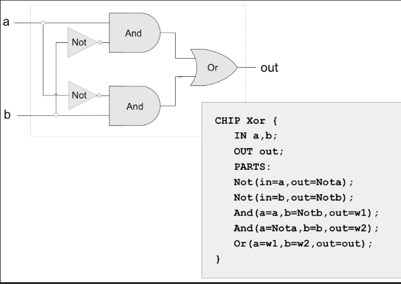
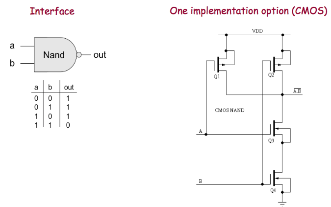

Semana 1: 
==========

Unidad 1: compuertas lógicas
------------------------------

Esta semana comenzaremos estudiando y construyendo los bloques
constitutivos básicos de una computador: las compuertas

Objetivos
^^^^^^^^^^
1. Introducir el curso.
2. Construir los circuitos digitales más básicos: las compuertas.

RoadMap
^^^^^^^^^^
¿Para dónde vamos en la primera parte del curso? Vamos a implementar
un computador.

¿Cómo se construye un computador? Se parte de un diseño que se
describe mediante algún lenguaje de descripción de hardware:

Luego el diseño se debe traducir a transistores y conexiones entre
estos:

Finalmente, los transistores y sus conexiones se deben transferir
a un medio físico. Esto se hace mediante un proceso conocido como
fotolitografía:

.. raw:: html

    

        <iframe width="560" height="315" src="https://www.youtube.com/embed/vK-geBYygXo" frameborder="0" allow="accelerometer; autoplay; encrypted-media; gyroscope; picture-in-picture" allowfullscreen></iframe>
    

Y ¿Cómo funciona un transistor?

.. raw:: html

    

        <iframe width="560" height="315" src="https://www.youtube.com/embed/tz62t-q_KEc" frameborder="0" allow="accelerometer; autoplay; encrypted-media; gyroscope; picture-in-picture" allowfullscreen></iframe>
    

En este curso vamos a implementar un computador usando un lenguaje
de descripción de hardware. Nuestro bloque de construcción básico será la
compuerta NAND y a partir de esta construiremos otros circuitos, que
a su vez utilizaremos para construir otros circuitos más complejos.
El proceso se irá repitiendo hasta llegar a un computador completo. No llegaremos
a nivel de transistores.

Código de honor
^^^^^^^^^^^^^^^^^
Al realizar el proyecto de esta semana se espera que hagas lo siguiente:

* Colabora con tus compañeros cuando así se indique.
* Trabaja de manera individual cuando la actividad así te lo proponga.
* NO DEBES utilizar sitios en Internet con soluciones o ideas para atacar el proyecto.
* NO DEBES hacer uso de foros para buscar soluciones al proyecto.
* ¿Entonces qué hacer si no me funciona algo? Te propongo que experimentes, crea hipótesis,
  experimenta de nuevo, observa y concluye.
* NO OLVIDES, este curso se trata de pensar y experimentar NO de BUSCAR soluciones
  en Internet.

Actividades
^^^^^^^^^^^^

Actividad 1
*************
* Fecha: julio 8 de 2020 - 8 a.m.
* Descripción: asiste al encuentro sincrónico donde se introducirá el curso y se
  explicará el reto de la semana, su importancia, su relación con los
  criterios de competencia y cómo será evaluada.
* Recursos: ingresar al grupo de `Teams <https://teams.microsoft.com/l/team/19%3a0568a505122249d19fb06bb1e2e466db%40thread.tacv2/conversations?groupId=dd8eb7ac-0f31-47e0-8d28-16de0ab80a0b&tenantId=618bab0f-20a4-4de3-a10c-e20cee96bb35>`__
* Duración de la actividad: 1:40 minutos sincrónicos.
* Forma de trabajo: grupal

Actividad 2
*************
* Fecha: julio 8 a julio 10 de 2020.
* Descripción: trabajo autónomo
* Recursos: 

    #. Lee el `capítulo 1 del libro guía <https://docs.wixstatic.com/ugd/44046b_f2c9e41f0b204a34ab78be0ae4953128.pdf>`__.
    #. También tienes disponible esta `presentación <https://drive.google.com/open?id=1MY1buFHo_Wx5DPrKhCNSA2cm5ltwFJzM>`__
       para que complementes.
    #. Instala las herramientas a utilizar y explóralas.
    #. Lee la definición del proyecto y la información que encuentras `aquí <https://www.nand2tetris.org/project01>`__
    #. Comienza a trabajar en el proyecto

* Duración de la actividad: 5 horas de trabajo autónomo
* Forma de trabajo: individual

Actividad 3
*************
* Fecha: julio 10 de 2020 - 8 a.m.
* Descripción: asiste al encuentro sincrónico para resolver dudas en tiempo real con el docente.
* Recursos: 

    #. Ingresar al grupo de `Teams <https://teams.microsoft.com/l/team/19%3a0568a505122249d19fb06bb1e2e466db%40thread.tacv2/conversations?groupId=dd8eb7ac-0f31-47e0-8d28-16de0ab80a0b&tenantId=618bab0f-20a4-4de3-a10c-e20cee96bb35>`__
    #. Continua trabajando en el `proyecto <https://www.nand2tetris.org/project01>`__

* Duración de la actividad: 1:40 minutos sincrónicos.
* Forma de trabajo: grupal
