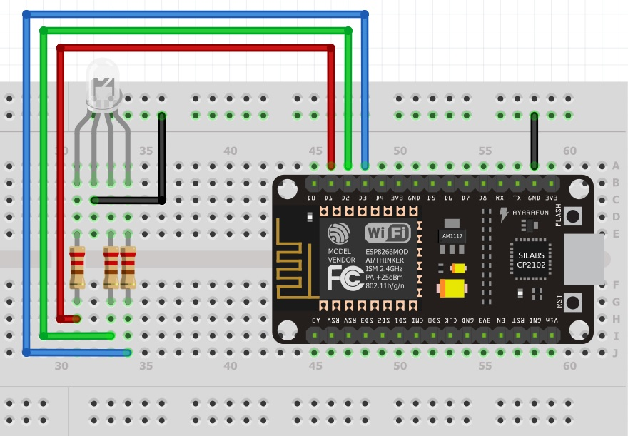
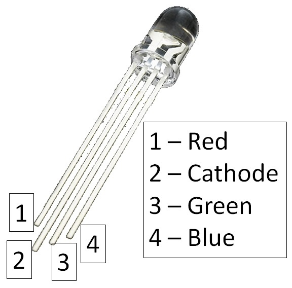

Semana 11
===========
Esta semana aprenderemos a utilizar las diferentes alternativas de entrada/salida que provee el framework de arduino con el 
ESP8266. Adicionalmente repasaremos el flujo de trabajo de la plataforma Arduino.

Objetivos
----------
1. Seguir un flujo de trabajo para desarrollar aplicaciones.
2. Explorar las capacidades de entrada/salida de la plataforma (arduino + esp8266)

Flujo de trabajo
-----------------
El flujo de trabajo para realizar aplicaciones con arduino será:

* Crear un archivo que tenga al menos las funciones ``setup()`` y ``loop()``.
* La función setup se ejecuta solo una vez al momentos de energizar el arduino o cuando se presiona el botón de reset.
* La función loop será llamada constantemente por el framework de arduino.
* Una vez escrita la parte de la aplicación que se desea probar, se debe compilar. El proceso de compilación verifica que 
  el programa no tenga errores sintácticos y genera el código de máquina que posteriormente se cargará en la memoria de
  programa del ESP8266. Para relizar la verificación y compilación se selecciona el primer ícono en la parte superior.
* Una vez compilada la aplicación se procede a grabar la memoria del microcontrolador. Esto se realiza con el segundo ícono
  de la parte superior izquiera.
* Finalmente se selecciona el ícono del monitor serial en la esquina superior derecha. Este ícono permite abrir la terminal
  serial por medio la cual se podrán visualizar los mensajes que la tarjeta ESP8266 le enviará al computador utilizando el 
  objeto ``Serial``.

RETO
-----
Retomando la guía de la semana 10, en este reto se pide conectar un LED a uno de los puertos GPIO del ESP8266 para encenderlo 
y apagarlo a una frecuencia de 1Hz.

Para este reto tenga en cuenta las siguientes figuras que muestran el nombre de los diferente puertos del ESP8266:

.. image:: ../_static/ESP8266.jpeg
   :scale: 60%

.. image:: ../_static/pinout.jpeg 
   :scale: 60%

Esta es la tabla que relaciona los puertos de entrada/salida del framework de arduino con los puertos del ESP8266:

=============  =============
Arduino        GPIO ESP8266
=============  =============
SDA            GPIO4
SCL            GPIO5
LED_BUILTIN    GPIO16
D0             GPIO16 
D1             GPIO5
D2             GPIO4
D3             GPIO0
D4             GPIO2
D5             GPIO14
D6             GPIO12
D7             GPIO13 
D8             GPIO15
D9             GPIO3
D10            GPIO1 
SS             GPIO15
MOSI           GPIO13
MISO           GPIO12
SCK            GRPIO14             
A0             ADC
=============  =============

Por ejemplo, si conecta el LED al puerto D2 (GPIO4), la función para configurar el puerto como entrada sería: 
``pinMode(D2,INPUT)``. Para escribir un alto en el pin sería ``digitalWrite(D2,HIGH)``. Para escribir un bajo sería 
``digitalWrite(D2,LOW)``.

Ejercicio: entradas digitales
--------------------------------
Si queremos leer información digital del mundo exterior, tendremos que configurar el puerto como entrada. Tenga en cuenta que
el voltaje máximo de entrada debe ser 3.3V y el mínimo 0V. El siguiente código permitirá leer el estado del puerto D3. Tenga 
en cuenta que al puerto D3 está conectado el pulsador marcado como FLASH:

.. code-block:: c 
   :lineno-start: 1

    void setup() {
    // put your setup code here, to run once:
    Serial.begin(115200);
    pinMode(D3, INPUT);
    }

    void loop() {
    // put your main code here, to run repeatedly:
    if (digitalRead(D3) == LOW) {
        Serial.println("D3 is LOW");
    }
    else {
        Serial.println("D3 is HIGH");
    }
    delay(1000);
    }             

La línea ``Serial.begin(115200)`` configura el puerto de comunicaciones con el computador a una velocidad de 115200 baud. 
Luego ``pinMode(D1, INPUT);`` configura D1 como entrada. ``digitalRead(D1)`` permite leer el estado de D1. Con 
``Serial.println("D1 is LOW");`` se mandan mensajes a través del puerto de comunicación con el PC.

Copie el código anterior a un archivo nuevo. Salve el archivo con un nombre. Compile y suba la aplicación a la memoria del
ESP8266. Finalmente abra la terminal serial y configure la velocidad de comunicación a a 115200 baud.

Ejercicio 2: plano de la tarjeta ESP8266
-----------------------------------------
Analice el plano de una tarjeta ESP8266. Este plano es similar al de la tarjeta que estamos utilizando, pero no es igual. 
En particular, la interfaz USB a serial no es la misma.

.. image:: ../_static/schematic.jpeg
   :scale: 80%

RETO:
-----
Realice un programa que prenda y apague el LED conectado en el puerto D2 mediante la lectura del pulsador conectado en 
el puerto D3 (pulsador FLASH). Si presiona el pulsador el LED debe encenderse. Si el pulsador se libera, el LED debe 
apagarse.

Ejercicio: manejo del tiempo
-----------------------------
El siguiente programa permite encender y apagar el LED conectado al puerto D0. Analice el programa. La función ``delay(500)``
bloqueará el ESP8266 por 500ms. Esto quiere decir que durante estos 500ms el programa no ejecutará ninguna otra instrucción 
de nuestro programa.

.. code-block:: c 
   :lineno-start: 1

    void setup() {
    // put your setup code here, to run once:
    pinMode(D0, OUTPUT);
    }

    void loop() {
    // put your main code here, to run repeatedly:
    digitalWrite(D0,LOW);
    delay(500);
    digitalWrite(D0,HIGH);
    delay(500);
    }  

RETO:
--------
Realice un programa que al presionar y soltar una vez el pulsador, conectado a D3, encieda y apague el led, conectado a 
D0, a una frecuencia de 0.5Hz. Al presionar y soltar de nuevo el pulsador el LED se debe apagar. El ciclo se repite 
infinitamente. 

RETO: 
--------
En el reto anterior habrá notado que mientras el programa está ejecutando la función ``delay``, no será posible 
leer el estado del pulsador conectado a D3 y por tanto se perderán eventos. Este comportamiento no es deseable y por 
tanto se deben emplear otras técnicas que permitan programar eventos temporales sin perder la capacidad de respuesta del 
sistema.

Para lograr lo anterior el framework de arduino ofrece la función ``millis()``. Esta función devuelve la cantidad de 
milisegundos que han transcurrido desde que la tarjeta se encendió o desde que el botán de reset se presionó. 

Analice el funcionamiento del siguiente ejemplo:

.. code-block:: c 
   :lineno-start: 1

    uint32_t oldMillis = 0;
    uint32_t interval = 1000;
    uint8_t portValue = LOW;

    void setup() {
    // put your setup code here, to run once:
    pinMode(D0, OUTPUT);
    digitalWrite(D0, LOW);
    }

    void loop() {
    // put your main code here, to run repeatedly:
    uint32_t now = millis();
    if ( ( now - oldMillis ) > interval) {

        oldMillis = now;
        if ( portValue == LOW) {
        digitalWrite(D0, HIGH);
        portValue = HIGH;
        }
        else {
        digitalWrite(D0, LOW);
        portValue = LOW;
        }
    }
    }

RETO:
--------
Utilizando la función  ``millis`` reimplemente el programa del reto anterior de tal forma que 
solucione los problemas de capacidad de respuesta a eventos externos.

.. note::

   ¡ALERTA DE SPOILER!

Ejercicio: solución a los dos retos anteriores 
-----------------------------------------------
Analice la solución a los dos retos anteriores y concluya:

.. code-block:: c 
   :lineno-start: 1

    uint8_t counter = 0;
    uint8_t pulsadorState = 0;

    void setup() {
    // put your setup code here, to run once:
    Serial.begin(115200);
    pinMode(D3, INPUT);
    pinMode(D0, OUTPUT);
    digitalWrite(D0, HIGH);
    }

    void toggle_led(uint16_t value) {
    digitalWrite(D0, LOW);
    delay(value);
    digitalWrite(D0, HIGH);
    delay(value);
    }

    void loop() {
    // put your main code here, to run repeatedly:
    switch (pulsadorState) {
        case 0:
        if(digitalRead(D3) == LOW){
        delay(20);
        pulsadorState = 1;
        Serial.println("Falling edge");
        }
        break;
        case 1:
        if(digitalRead(D3) == HIGH){
        delay(20);
        pulsadorState = 0;
        counter++;
        Serial.println("Rising edge");
        }
        break;
    }

    if(counter == 1){
        toggle_led(1000);
        Serial.println("Toggle");
    }
    if(counter == 2){
        digitalWrite(D0,HIGH);
        counter = 0;
        Serial.println("OFF");     
    }
    }

.. code-block:: python
   :lineno-start: 1

    uint8_t counter = 0;
    uint8_t pulsadorState = 0;
    uint32_t old = 0;
    uint8_t portValue = 0;

    void setup() {
    // put your setup code here, to run once:
    Serial.begin(115200);
    pinMode(D3, INPUT);
    pinMode(D0, OUTPUT);
    digitalWrite(D0, HIGH);
    }

    void toggle_led(uint16_t value) {
    uint32_t now = millis();
    if ( ( now - old ) > value) {
        Serial.println("Toggle");
        old = now;
        if ( portValue == 0) {
        digitalWrite(D0, LOW);
        portValue = 1;
        }
        else {
        digitalWrite(D0, HIGH);
        portValue = 0;
        }
    }
    }

    void readPulsador() {
    switch (pulsadorState) {
        case 0:
        if (digitalRead(D3) == LOW) {
            delay(20);
            pulsadorState = 1;
            Serial.println("Falling edge");
        }
        break;
        case 1:
        if (digitalRead(D3) == HIGH) {
            delay(20);
            pulsadorState = 0;
            counter++;
            Serial.println("Rising edge");
        }
        break;
    }
    }

    void loop() {
    // put your main code here, to run repeatedly:
    readPulsador();

    if (counter == 1) {
        toggle_led(1000);
    }

    if (counter == 2) {
        digitalWrite(D0, HIGH);
        portValue = 0;
        counter = 0;
        Serial.println("OFF");
    }
    }

Ejercicio: entrada analógica
----------------------------
La tarjeta de desarrollo que estamos utilizando solo tiene disponible una entrada analógica, ``ADC``. Esta entrada recibe
valores entre 0V y 3.3V. La función ``analogRead(A0)`` permite leer la entrada ADC y devuleve valores entre 0 y 1024 
correspondientes a 0V y 3.3V

Implemente el circuito que muestra la figura:

.. image:: ../_static/potenciometer.jpeg

Analice el siguiente código que ilustra como acceder a la entrada analógica. 

.. code-block:: c
   :lineno-start: 1

    void setup() {
    // put your setup code here, to run once:
    Serial.begin(115200);
    }

    void loop() {
    // put your main code here, to run repeatedly:
    uint16_t analogValue;
    uint32_t mV;

    analogValue = analogRead(A0);
    Serial.print("ADC value: ");
    Serial.println(analogValue);
    mV = (analogValue * 3300) / 1024;
    Serial.print("mV: ");
    Serial.println(mV);
    delay(1000);
    }

Ejercicio: Pulse Width Modulation (PWM)
-----------------------------------------
La modulación por ancho de pulso es una técnica que permite simular una señal analógica mediante un salida digital. La 
técnica consiste en hacer que la señal digital cambie de ON a OFF a muy alta velocidad. De esta manera el componente que esté 
conectado a la salida digital "verá" al promedio de la señal. Una aplicación típica es utilizar PWM para variar el brillo 
de un LED. Si la frecuencia de la señal de PWM es lo suficientemente alta (mayor a 60 Hz) el ojo humano no será capaz de 
detectar que el LED se está enciendo y apagando, por tanto, verá el promedio de la señal. El LED se observará más 
brillante si la señal pasa más tiempo en ON que en OFF y menos brillante en el caso contrario. 

En el ESP8266 es posible hacer PWM en todos los GPIO menos en el GPIO16. Si la aplicación tiene varias salidas de PWM, todas
tendrán la misma frecuencia que variará entre 1 Hz y 1000 Hz. El tiempo en ON o ``duty cycle`` se podrá variar entre 0 (0%) 
y 1023 (100%).

La función ``analogWrite(pin, value)`` permite generar la señal de PWM en el ``pin`` especificado.
``analogWrite(pin, 0) deshabilitará el PWM en el  ``pin``. El valor de ``value`` estará en el rango de 0 a PWMRANGE, 
el cual es 1023 por defecto. El valor de PWMRANGE puede cambiarse llamando ``analogWriteRange(new_range)``.

La frecuencia del PWM por defecto es 1000Hz. ``analogWriteFreq(new_frequency)`` cambiará la frecuencia.

Monte el circuito que muestra la figura:

Copie el siguiente programa:

.. code-block:: c 
   :lineno-start: 1

    void setup() {
    // put your setup code here, to run once:
    Serial.begin(115200);
    analogWriteFreq(500);
    analogWrite(D1, 0);
    analogWrite(D2, 0);
    analogWrite(D3, 0);
    }

    void loop() {
    // put your main code here, to run repeatedly:
    if (Serial.available()) {
        int16_t data = Serial.read();
        if (data == 'r') {
        analogWrite(D1, 1023);
        analogWrite(D2, 0);
        analogWrite(D3, 0);
        }
        if (data == 'g') {
        analogWrite(D1, 0);
        analogWrite(D2, 1023);
        analogWrite(D3, 0);
        }
        if (data == 'b') {
        analogWrite(D1, 0);
        analogWrite(D2, 0);
        analogWrite(D3, 1023);
        }
    }
    }

Una vez grabe el programa en la memoria del microcontrolador, abra el monitor serial. Configure la velocidad de 
comunicación a 115200. Escriba en el campo texto la letra ``r`` y luego ``ENVIAR``. Repita lo mismo con las letras 
``g`` y ``b``.

Ejercicio: sensores con buses digitales
----------------------------------------
Para este ejercicio vamos a utilizar un sensor de temperatura, humedad y presión barométrica. El sensor es fabricado por 
la empresa Bosh y la referencia es `BME280 <https://www.bosch-sensortec.com/bst/products/all_products/bme280>`__. Este 
sensor utiliza un bus digital llamado ``I2C``. Este bus permite comunicar la tarjeta ESP8266 con el sensor por medio dos 
cables llamados SCL (para el reloj) y SDA (para los datos).

Antes de conectar el sensor al ESP8266, desconecte el cable USB para remover la alimentación. Debemos conectar el sensor así:

========== =======
ESP8266    BME280
========== =======
3.3V       VCC
GND        GND
GPIO5(D1)  SCL       
GPIO4(D2)  SDA     
========== =======

En cuanto al software, debemos instalar una biblioteca que permita leer el sensor. Siga los siguientes pasos para instalar
la biblioteca:

* Ingrese al menún Programa.
* Seleccione Incluir Librería.
* Seleccione Gestionar Librería.
* En el campo de filtrado de búsqueda escriba BME280 ``Adafruit BME280``.
* Seleccione el item encontrado e instale la biblioteca.
* Decargue esta `biblioteca <https://github.com/adafruit/Adafruit_Sensor>`__. Click en  Clone or Download y luego
  en download ZIP.
* Una vez descargada la biblioteca seleccione en el IDE de Arduino Programa, Incluir Libraría, Añadir Libraría .zip ...

Siga los siguientes pasos para probar el sensor:

* Abra Archivo, Ejemplos. Navegue hasta la parte inferior de los ejemplos colocando el mouse sobre la flecha negra que está 
  en la parte inferior del menú.
* Seleccione Adafruit BME280 Library y luego bme280test
* En la función ``setup()`` modifique ``Serial.begin(9600);`` por ``Serial.begin(115200);`` y ``status = bme.begin();`` 
  por ``status = bme.begin(0x76);``
* Compile y grabe el programa.
* Abra el Monitor Serie asegurándose que la velocidad de comunicación es 115200.
* El resultado esperado será::

    Temperature = 27.14 *C
    Pressure = 843.77 hPa
    Approx. Altitude = 1517.64 m
    Humidity = 55.11 %
