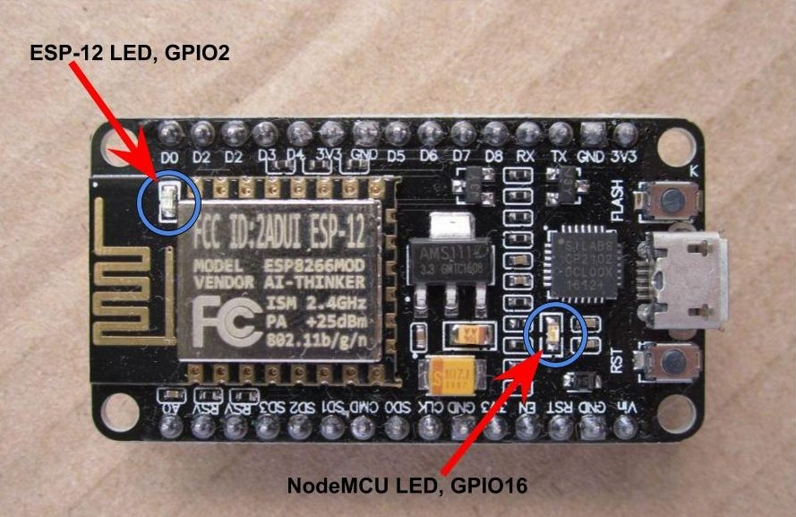
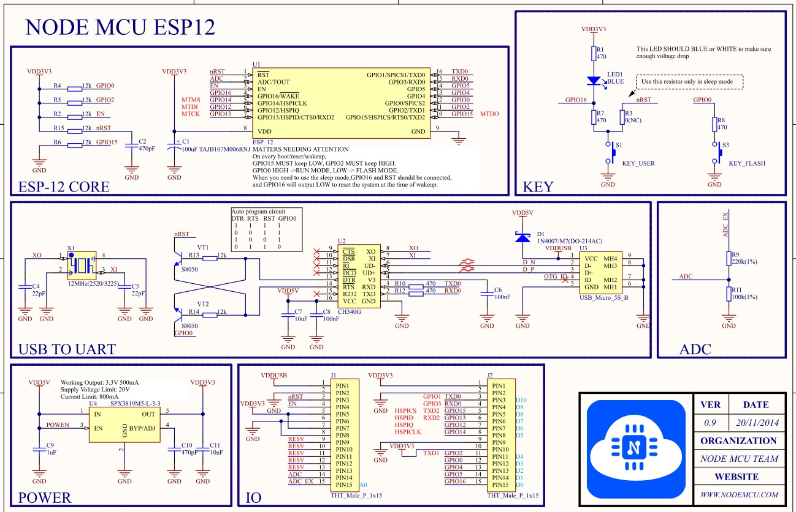
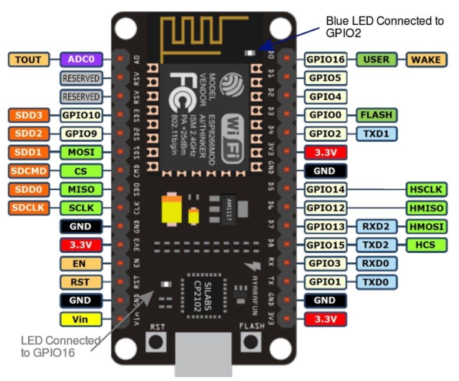
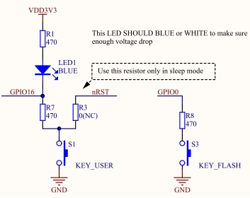
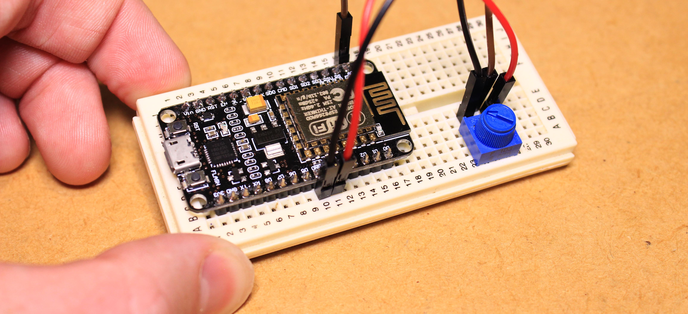

Semana 11
===========
Esta semana aprenderemos a utilizar las diferentes alternativas de entrada/salida que provee micropython con el 
ESP8266. Adicionalmente seguiremos un flujo de trabajo de aplicaciones (workflow) similar al utilizado en otras plataformas 
como Arduino.

Objetivos
----------
1. Seguir un flujo de trabajo para desarrollar aplicaciones.
2. Explorar las capacidades de entrada/salida de la plataforma.

Ejercicios de python utilizando micropython
--------------------------------------------
* Abra la interfaz de REPL de micropython. Utilice putty en windows o screen en macosX.
* Cree algunas variables e inicialice dichas varibles con valores.
* ¿Por qué no puede utilizar las siguientes palabras como nombres de variables::

    and         for         raise
    assert      from        return
    break       global      try
    class       if          while
    continue    import      with
    def         in          yield
    del         is
    elif        lambda
    else        not
    except      or
    exec        pass
    finally     print
* En python es posible escribir comentarios en el código utilizando ``#`` al inicio de la línea; sin embargo,
  cuando escribamos programas evitaremos emplear los comentarios ya que a diferencia de un computador, esta información
  ocupará espacio en la memoria de programa del controlador.
* Recuerde que python no emplea, como otros lenguajes de programación, llaves (``{ }``) para formar bloques de código. 
  En cambio, utiliza identación. Utilizando la interfaz REPL, evalue el siguiente código:

  .. code-block:: python

     if sum == 10:
        print('Es igual')
     else:
        print('Es diferente')

* Cree los siguientes tipos de datos: numérico, cadena, lista, tupla y diccionario. 
* Cree los siguiente tipos de datos numéricos: enteros, números en hexadecimal, número en punto
  flotante, números complejos. (¿Qué se puede concluir de los número complejos en micropython?)
* Cree la siguiente cadena: mi_nombre= 'Juan Franco'. ¿Cuál es el resultado de las siguientes expresiones?

  .. code-block:: python

     s = mi_nombre[0]     
     s = mi_nombre[2:4]    
     s = mi_nombre[1:4]    
     s = mi_nombre[3:]    

* ¿Cuál es el resultado de hacer mi_nombre*2?
* ¿Cuál es el resultado de hacer mi_nombre + 'UPB'
* Cuál es el resultado de hacer 

  .. code-block:: python

     s = 'Hola'
     s[0] = R

* Cree una lista. Cambie uno de los valores de la lista. ¿Qué puede concluir de las listas en relación a las cadenas?
* Cree una matriz de 3x3 utilizando una lista.
* Para los siguientes ejercicios asuma ``A = 0 0 1 1 1 1 0 0`` , ``B = 1 1 0 0 1 1 0 1``
* Haga ejemplos que utilicen los siguientes operandos: ``+,-,*,/,%,**``
* Haga ejemplos que utilicen los siguientes operandos: ``==, !=, >,<, >=, <=``
* Haga ejemplos que utilicen los siguientes operandos: ``and, or, not``
* Haga ejemplos que utilicen los siguientes operandos: ``=, +=, -=, *=, /=, **=``
* Para este ejercicio, repase las operaciones a nivel de bits que realizamos en la primer parte del curso. 
  Luego haga ejemplos que utilicen los siguientes operandos: ``&, |, ^, ~, <<, >>``
* Realice un ejemplo para cada una de las siguientes estructuras de control:
  
  .. code-block:: python

     if
     if..else
     elif
     for
     while
     break
     continue
     pass

* Utilice la interfaz REPL y explore las siguientes funciones:

  .. code-block:: python

     int()
     float()
     abs()
     bin()
     ceil()
     exp()
     floor()
     hex()
     log()
     pow()
     round()
     sqrt()

* En algunas cadenas, es necesario utilizar caracteres ASCII no imprimibles por ejemplo: ``\n`` (newline), 
  ``\r`` (carriage-return), ``\t`` (tab). Experimente en la terminal REPL con estos caractares.
* En python es posible utilizar cadenas formateadas. Experimente con las siguientes líneas de código:

  .. code-block:: python

     '{} {}'.format(1, 2)
     '{1} {0}'.format('one', 'two')
* Experimente con las siguientes funciones para manejo de cadenas:

  .. code-block:: python

     count()
     find()
     len()
     isalpha()
     isalnum()
     isdigit()
     islower()
     iupper()
     lower()
     upper()
     lstrip()
     rstrip()
* Experimente con las siguientes funciones para manejo de listas:

  .. code-block:: python

     del()
     list.append()
     cmp()
     len()
     max()
     Min()
     list.count()
     list.index()
     list.insert()
     list.remove()
     list.reverse()
     list.sort()

* Experimente con las siguientes funciones para manejo de diccionarios:

  .. code-block:: python

     cmp()  
     len
     del()
     d.clear()
     d.keys()
     d.values()

* Experimente con las siguientes funciones para manejo de fechas y tiempo. Note que será necesario que importe la biblioteca
  time (import time)

  .. code-block:: python

     time.localtime()
     time.sleep()
     time.sleep_ms()
     time.sleep_us()

* Realice una función que multiplique dos números recibidos como parámetros.
* Tenga presente que las variables que utilice en una función serán variables locales a la función. Por tanto, una vez 
  la función retorne, la información de las variables locales se perderá. Explique el comportamiento de este programa:

  .. code-block:: python

    def foo():
        y = "local"
    foo()
    print(y)

* Explique qué pasa al ejecutar este código y por qué:

  .. code-block:: python

    x = "global"
    def foo():
        x = x * 2
        print(x)
    foo()

* Para utilizar variables locales y globales, considere el siguiente ejemplo:

  .. code-block:: python

     x = "global"
     def foo():
         global x
         y = "local"
         x = x * 2
         print(x)
         print(y)
        
     foo()
     
* Analice el siguiente programa:

  .. code-block::python

     x = 5
     def foo():
         x = 10
         print("local x:", x)

     foo()
     print("global x:", x)

* En micropython es posible leer información desde la terminal. Analice el siguiente código:

  .. code-block::python

     name = input('Ingrese su nombre: ')
     print(name)

* Es posible manipular archivo un micropython; sin embargo, es recomendable evitar, por ahora, el uso de archivos a menos 
  que se indique lo contrario. La razón es que un mal uso de estos puede dejar inservible la memoria del microcontrolador.
  Como ejemplo, para listar el contenido del sistema de archivos de micropython ejecute este programa:

  .. code-block:: python

     import os 
     os.listdir()

Ejercicio: Flujo de trabajo
----------------------------
Con micropython se puede seguir un flujo de trabajo similar al utilizado con el framework de Arduino para realizar 
aplicaciones. Para ello, necesitaremos la aplicaciones instalada la semana pasada: ``ampy``. La aplicación ampy será 
ejecutada desde una línea de comandos en windows o una terminal en macosX.

* Abra la terminal de comandos y ejecute::

    ampy --help

* Antes de utilizar la herramienta ampy, utilice el RPEL para deshabilitar la salida de depuración de micropython::

  >>>import esp
  >>>esp.osdebug(None)

* Con ampy es posible escribir código en el computador y correr ese código en el ESP8266. Para ecribir código se recomieda 
  utilizar un editor como Visual Studio Code o cualquier otro de su gusto. Escriba el siguiente código y guardelo con el 
  nombre ``test.py``

  .. code-block:: python

     print('Hola desde UPB! conteo hasta 10:')
     for i in range(1,11):
         print(i)

* Ejecute la siguiente línea en la terminal de comandos. Cambio serial_port por el puerto correspondiente en su computador::

    ampy --port serial_port run test.py

  Si al ejecutar el programa ocurre un error, puede ser que tenga abierto el REPL y por tanto deberá cerrarlo ya que 
  ampy intentará abrir el puerto serial al cual está conectado el ESP8266. ¿Cuál es el resultado? tenga en cuenta que si 
  el programa requiere una entrada, será necesario ejecutarlo desde la interfaz REPL.

* Por defecto el comando run esperará a que el programa termine antes de imprimir el resultado; sin embargo, algunos 
  programas se quedarán en un ciclo infinito y nunca retornarán. En estos casos se debe adicionar la opción ``--no-output``. 
  De esta manera ampy no esperará la terminación del programa. Para probar lo anterior, modifique el programa así:

  .. code-block:: python

     import time

     print('Hola desde UPB! contando:')
     while True:
        print(i)
        i += 1
        time.sleep(1)

* Ejecute el programa así::

    ampy --port serial_port run  --no-output test.py

* Luego abra la interfaz REPL para observar el resultado.

* Cuando se escriben programas utilizando el framework de arduino, se emplean dos funciones: ``setup()`` y ``loop()``. 
  La función setup() se ejecuta sólo una vez mientras que la función loop() se repite indefinidamente. Esta estructura 
  de código se puede recrear un micropython:
  
   .. code-block:: python

        ##################
        # código setup
        ##################
        import time

        print('Hola desde UPB! contando:')
        i = 1
        while True:
        ##################
        # código loop
        ##################
            print(i)
            i += 1
            time.sleep(1)

* ampy también permite manipular el sistema de archivos de micropython. Es posible copiar archivos en el ESP8266, leerlos y 
  crear directorios. Copie el archivo test.py en la tarjeta::

    ampy --port /serial/port put test.py

  Para verificar el resultado ejecute:

    ampy --port /serial/port ls

* Para leer archivos::

    ampy --port /serial/port get boot.py

* También es posible compiar el contenido de boot.py en el computador especificando un nombre de archivo::

    ampy --port /serial/port get boot.py board_boot.py

* Para borrar un archivo::

    ampy --port /serial/port rm test.py

* Para borrar un directorio con todo su contenido::

    ampy --port /serial/port rmdir nombre_directorio

* En micropython existen dos archivos importantes: boot.py y main.py. Actualmente main.py no lo hemos creado. ``booy.py`` 
  será ejecutado automáticamente cuando la tarjeta se encienda o se presione el botón reset (RST). Si el archivo 
  ``main.py`` existe, micropython lo ejecutará luego de boot.py. Por tanto, en ``main.py`` debemos escribir el código 
  que deseamos que se ejeucte cada que la tarjeta se encienda. Tenga en cuenta que este programa quedará almacenado y la 
  tarjeta se comportará como lo especifiquemos allí. Para probar lo anterior, ejecute::

    ampy --port /serial/port put test.py /main.py

  Esto hará que el código que hemos venido utilizando se almacene en la tarjeta como main.py. Para probarlo, descenecte 
  y conecte de nuevo la tarjeta e ingrese a la inferfaz REPL. ¿Cuál es el resultado?

En resumen, el flujo de trabajo será así:

1. Escribir el programa en el computador utilizando su editor de texto favorito. Estructure el código con una sección 
   setup y otra loop.
2. Utilice ``ampy`` con la opción ``--no-output`` para correr el script en la tarjeta.
3. Edite el programa tantas veces como haga falta hasta que funcione como desea
4. Si desea que el programa corra automáticamente cada que la tarjeta se encienda utilice ``ampy`` con el comando ``puy`` 
   salvando el archivo con el nombre ``main.py``

RETOS
-----------------
El propósito de estos ejercicios será practicar lo aprendido hasta ahora:

Reto 1:
^^^^^^^^
Escriba un programa que lea el radio y la altura de un cilindro (debe preguntarle al usuario) y luego imprima 
el área y el volumen.

Reto 2:
^^^^^^^^
Repita de nuevo el programa anterior pero esta vez cree y utilice funciones para calcular el área y el volumen.

Reto 3:
^^^^^^^^
Escriba un programa que lea un palabra (le pregunta al usuario) y luego imprima cada una de las letras que la componen.

Reto 4:
^^^^^^^^
Escriba un programa que permita calcular: suma, resta, multiplicación y división. El programa debe preguntarle al usuario 
la operación y los operandos. Luego de una operación, el programa debe preguntar si se desea continuar, de lo contrario 
se debe terminar.

Ejercicio: salida digital
---------------------------

La tarjeta ESP8266 que tenemos posee dos LEDs como muestra la figura:

Las siguientes figuras servirán como referencia para entender el funcionamiento del hardware y los puertos de entrada/salida 
de la tarjeta. El plano es similar al de la tarjeta que estamos utilizando, pero no es igual. En particular, la interfaz 
USB a serial no es la misma.

Ambos LEDs se enciende con 0V y se apagan con 3.3V. Para controlar los LEDs o cualquier otro puerto de entrada/salida 
se utiliza la biblioteca ``machine``. Para probar los LED escriba las siguientes líneas de código en la interfaz REPL

   .. code-block:: python

      import machine
      pin1 = machine.Pin(2,machine.Pin.OUT)
      pin2 = machine.Pin(16,machine.Pin.OUT)
      pin1.on()
      pin2.on()
      pin1.off()
      pin2.off()

La línea ``import machine`` importa la biblioteca machine. Los puertos de GPIO son 
configurables como entrada o como salida. La línea ``machine.Pin(16,machine.Pin.OUT)`` configura el puerto GPIO16 como salida.
Finalmente, ``pin2.on()`` colocará 3.3V en el puerto GPIO16 y por tanto el LED se apagará. ``pin2.off()`` colocará 0V en 
GPIO16 y el LED se encenderá. Este comportamiento puede entenderse analizando el diagrama del LED en el plano de la tarjeta:

Ejercicio: entrada digital
---------------------------
Si queremos leer información digital del mundo exterior, tendremos que configurar el puerto como entrada. Tenga en cuenta que
el voltaje máximo de entrada debe ser 3.3V y el mínimo 0V. El siguiente código permitirá leer el estado del puerto GPIO0:

   .. code-block:: python
      
      import machine
      pin0 = machine.Pin(0,machine.Pin.IN)
      pin0.value()

La línea ``pin0 = machine.Pin(0,machine.Pin.IN)`` configurará el puerto GPIO0 como entrada. Con a línea ``pin0.value()`` 
se podrá leer el valor del puerto. Si el voltaje es 3.3V el resultado será 1 y el voltaje es de 0V el resultado será 0.
Presione y mantega presionado el pulsador marcado con la palabra flash. Sin dejar de presionar el pulsados, ejecute de nuevo 
``pin0.value()``. ¿Cuál es el resultado.

RETO 5:
-------
Realice un programa que prenda y apague el LED conectado en el puerto GPIO16 mediante la lectura del pulsador conectado en 
el puerto GPIO0. Si presiona el pulsador el LED debe encenderse. Si el pulsador se libera, el LED debe apagarse.

Ejercicio: manejo del tiempo
-----------------------------
El manejo del tiempo se puede realizar utilizando la biblioteca `utime`. 
En este `sitio <https://docs.micropython.org/en/latest/esp8266/library/utime.html>`__ 
se puede encontrar la documentación.

El siguiente código encenderá y apagará el LED conectado a GPIO2 a una frecuencia de 1Hz:

   .. code-block:: python
      
      import machine
      import utime
      pin = machine.Pin(2,machine.Pin.OUT)

      def toggle_led():
        pin.on()
        utime.sleep_ms(500)
        pin.off()
        utime.sleep_ms(500)
    
      while True:
        toggle_led()
      
RETO 6:
--------
Realice un programa que al presionar y soltar una vez el pulsador, conectado a GPIO0, encieda y apague el led, conectado a 
GPIO16, a una frecuencia de 0.5Hz. Al presionar y soltar de nuevo el pulsador el LED se debe apagar. El ciclo se repite 
infinitamente. 

RETO 7: 
--------
Del reto anterior habrá notado que mientras el programa está ejecutando la función ``utime.sleep_ms`` no podrá leer el estado
del pulsador conectado a GPIO0 y por tanto se perderán eventos. Este comportamiento no es deseable y por tanto se deben 
emplear otras técnicas que permitan programar eventos temporales sin perder la capacidad de respuesta del sistema.

La biblioteca utime ofrece el método ``utime.ticks_diff(ticks1, ticks2)`` que permite calcular la diferencia entre dos 
intervalos de tiempo así: ``ticks1 - ticks2``. Analice el funcionamiento del siguiente ejemplo:

.. code-block:: python

    from machine import Pin
    from utime import ticks_ms,ticks_diff

    pin = Pin(16, Pin.OUT)
    pin.value(0)

    startTime = ticks_ms()
    pinState = 0
    while True:
        now =  ticks_ms()
        if ticks_diff(now,startTime) > 500:
            startTime = now
            if pinState == 0:
                pin.value(1)
                pinState = 1
            else:
                pin.value(0)
                pinState = 0

RETO 8:
--------
Utilizando el método ``utime.ticks_diff(ticks1, ticks2)`` reimplemente el programa del reto anterior de tal forma que 
solucione los problemas de capacidad de respuesta a eventos externos al sistema.

.. note::

   ¡ALERTA DE SPOILER!

Ejercicio: solución a los dos retos anteriores 
-----------------------------------------------
Analice la solución a los dos retos anteriores y concluya:

.. code-block:: python

    import utime
    from machine import Pin 

    pin16 = Pin(16, Pin.OUT)
    pin0 = Pin(0,Pin.IN)

    def toggle_led(value):
        pin16.off()
        utime.sleep_ms(value)
        pin16.on()
        utime.sleep_ms(value)

    counter = 0
    pulsadorState = 0
    while True:
        if pulsadorState == 0:
            if pin0.value() == 0:
                utime.sleep_ms(20)
                pulsadorState = 1
                print('falling edge')
        if pulsadorState == 1:
            if pin0.value() == 1:
                utime.sleep_ms(20)
                pulsadorState = 0
                counter = counter + 1
                print('rising edge')
        if counter == 1:
            toggle_led(1000)
            print('toggle')
        if counter == 2:
            pin16.on()
            counter = 0
            print('off')

.. code-block:: python

    import utime
    from machine import Pin 

    pin16 = Pin(16, Pin.OUT)
    pin0 = Pin(0,Pin.IN)

    ticks1 = 0
    pinState = 0 

    def toggle_led(value):
        global ticks1
        global pinState
        ticks2 = utime.ticks_ms()
        if utime.ticks_diff(ticks1, ticks2) < 0:
            if pinState == 0:
                pin16.off()
                pinState = 1
            else:
                pin16.on()
                pinState = 0
            ticks1 = utime.ticks_ms() + value

    counter = 0
    pulsadorState = 0

    while True:
        if pulsadorState == 0:
            if pin0.value() == 0:
                utime.sleep_ms(20)
                pulsadorState = 1
                print('falling edge')
        if pulsadorState == 1:   
            if pin0.value() == 1:
                utime.sleep_ms(20)
                pulsadorState = 0
                counter = counter + 1
                print('rising edge')
                ticks1 = utime.ticks_ms()
        if counter == 1:
                toggle_led(1000)
                print('toggle')
        if counter == 2:
            pin16.on()
            pinState = 0
            counter = 0
            print('off')

Ejercicio: entrada analógica
----------------------------
La tarjeta de desarrollo que estamos utilizando solo tiene disponible una entrada analógica, ``ADC0``. Esta entrada recibe
valores entre 0V y 3.3V. `Micropython <https://docs.micropython.org/en/latest/esp8266/esp8266/tutorial/adc.html>`__ 
entrega valores entre 0 y 1024 correspondientes a 0V y 3.3V

Implemente el circuito que muestra la figura:

Analice el siguiente código que ilustra como acceder a la entrada analógica. El programa imprime en la interfaz REPL el 
voltaje ingresado en el puerto.

.. code-block:: python

    from machine import ADC
    import utime
    import math

    adc = ADC(0)

    while True:
        value = adc.read()
        print('adc value: {}'.format(value))
        mV = (value*3300) / 1024
        print('voltaje en mV: {}'.format(math.trunc(mV)))
        utime.sleep(1)

Ejercicio: Pulse Width Modulation (PWM)
-----------------------------------------

Ejercicio: clase Timer
-----------------------

Ejercicio: clase Real Time Clock (RTC)
---------------------------------------

Ejercicio: sensores con buses digitales
----------------------------------------

