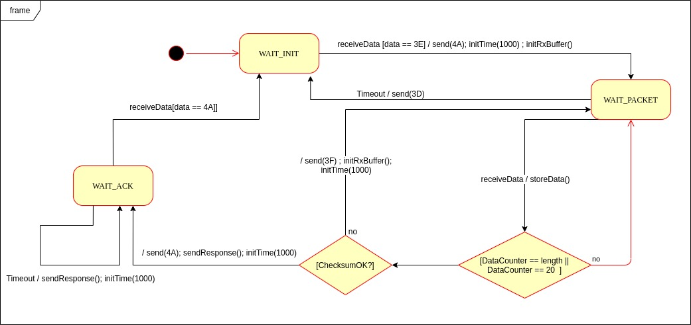

Semana 12
===========

Esta semanas vamos a estudiar más en detalle cómo funciona el puerto
serial de un controlador y cómo se usa este desde el framework de arduino.
Vamos a introducir también la técnica de programación
con máquinas de estados.

Sesión  1
----------
En esta sesión comenzaremos revisando cómo funciona el puerto serie.

Ejercicio 1
^^^^^^^^^^^^^
En este ejercicio vamos a introducir cómo funcionan las comunicaciones
seriales. Para ello vamos a tomar material de
`este <https://learn.sparkfun.com/tutorials/serial-communication/all>`__
sitio.

Ejercicio 2
^^^^^^^^^^^^^^^^^^
¿Dónde encuentro el API de arduino para el manejo del serial?

`Aquí <https://www.arduino.cc/reference/en/language/functions/communication/serial/>`__

Ejercicio 3
^^^^^^^^^^^^^^^^^^
Vamos a responder algunas preguntas (hay que tomar nota de las soluciones)

* ¿Qué pasa cuando hago un Serial.available()?
* ¿Qué pasa cuando hago un Serial.read()?
* ¿Qué pasa cuando hago un Serial.read() y no hay nada en el buffer de
  recepción?
* Un patrón común al trabajar con el puerto serial es este:

.. code-block:: cpp
   :lineno-start: 1  

    if(Serial.available() > 0){
        int dataRx = Serial.read() 
    }

* ¿Cuánto datos lee Serial.read()?
* ¿Y si quiero leer más de un dato? No olvide que no se pueden leer más datos
  de los disponibles en el buffer de recepción, claramente porque no hay
  más datos que los que tenga allí.

Ejercicio 4
^^^^^^^^^^^^^^^^^^
Vamos a leer 3 datos del puerto serial:

.. code-block:: cpp
   :lineno-start: 1  

    if(Serial.available() >= 3){
        int dataRx1 = Serial.read()
        int dataRx2 = Serial.read() 
        int dataRx3 = Serial.read() 
    }

Ejercicio 5
^^^^^^^^^^^^^^^^^^
¿Qué escenarios podría tener en este caso?

.. code-block:: cpp
   :lineno-start: 1  

    if(Serial.available() >= 2){
        int dataRx1 = Serial.read()
        int dataRx2 = Serial.read() 
        int dataRx3 = Serial.read() 
    }

Explique detalladamente, recurriendo al material del
ejercicio 1, cómo se podría explicar cada escenario.

Ejercicio 6: RETO
^^^^^^^^^^^^^^^^^^
Piense cómo podría hacer lo siguiente:

.. code-block:: cpp
   :lineno-start: 1  

    void taskSerial(){
        // Tener encapsulado en la tarea el buffer
    }

    void loop(){
        taskSerial();
    }

* Almacenar los datos en su propio buffer de recepción
  (el buffer será un arreglo).
* El buffer debe estar encapsulado en la tarea
* Los datos almacenados en el buffer no se pueden perder
  entre llamados a taskSerial() en la función loop.  
* ¿Cómo hacer para saber en cualquier parte de taskSerial()
  cuántos datos tengo guardados en el buffer de recepción?

Ejercicio 7
^^^^^^^^^^^^^^^^^^
Vamos a detenernos un momento en el software del lado del
computador: el terminal. Veamos dos de ellas, la terminal
de arduino y `esta <https://sourceforge.net/projects/scriptcommunicator/>`__
otra (scriptcommunicator)

* ¿Qué es un programa terminal? 
* ¿Para qué sirve?

Ejercicio 8
^^^^^^^^^^^^^^^^^^
Considere el siguiente programa

.. code-block:: cpp
   :lineno-start: 1  

    void setup()
    {
      Serial.begin(9600);
    }

    void loop()
    {

      if(Serial.available() > 0){

        Serial.read();

        int8_t var = -1;

        Serial.println("Inicio de la prueba");
        Serial.write(var);
        Serial.print("\n");
        Serial.print(var);
        Serial.print('\n');
        Serial.println("Fin de la prueba"); 
      }
    }

* Observe el resultado de la prueba.
* ¿Qué observa en la terminal de arduino para cada caso?

.. code-block:: cpp
   :lineno-start: 1  

    Serial.write(var);
    Serial.print(var);

* ¿Qué observa en scriptcommunicator para cada caso?
*  En la siguiente parte del código:

.. code-block:: cpp
   :lineno-start: 1  

    if(Serial.available() > 0){

        Serial.read();

Comente la línea Serial.read()

.. code-block:: cpp
   :lineno-start: 1  

    if(Serial.available() > 0){

        //Serial.read();

* ¿Qué ocurre? ¿Por qué ocurre esto?

En la siguiente parte del código:

.. code-block:: cpp
   :lineno-start: 1  

    Serial.println("Inicio de la prueba");
    Serial.write(var);
    Serial.print("\n");
    Serial.print(var);
    Serial.print('\n');
    Serial.println("Fin de la prueba"); 

¿Cuál es la diferencia entre estas dos líneas de código?

.. code-block:: cpp
   :lineno-start: 1  

   Serial.print("\n");

   Serial.print('\n');

Ejercicio 9: RETO
^^^^^^^^^^^^^^^^^^
Considere el siguiente código para analizar en scriptcommunicator:

.. code-block:: cpp
   :lineno-start: 1  

    void setup()
    {
      Serial.begin(9600);
    }

    void loop()
    {

      if(Serial.available() > 0){
        Serial.read();
        int8_t var = 255;
        int8_t var2 = 0xFF;

        Serial.write(var);
        Serial.print(var);
        Serial.write(var2);
        Serial.print(var2);

      }
    }

Explique con convicción qué está ocurriendo en cada caso.

Ejercicio 10: RETO
^^^^^^^^^^^^^^^^^^^
Este reto es para las horas de trabajo autónomas del curso:

* Repita lentamente los ejercicios de esta sesión: analice, analice,
  analice.
* Experimente con los ejercicios de esta sesión y de nuevo: analice;
  haga cambios; hágase preguntas antes de ejecutar los cambios; si no
  compila busque por qué, si no encuentra la respuesta documente y
  consulte a su profe; antes de ejecutar un cambio piense qué pasará y
  luego ejecute, compare, analice.
* Haga lo anterior con cada ejercicio hasta que se asegure de comprender.
  NO OLVIDE: antes de ejecutar es importante predecir qué pasará y luego
  contrastar.

Sesión  2
----------
En este punto ya tenemos todos los elementos para abordar la construcción
de una aplicación utilizando máquinas de estado.

Ejercicio 1: enunciado del problema
^^^^^^^^^^^^^^^^^^^^^^^^^^^^^^^^^^^^^

En un proyecto interactivo se requiere conectar un controlador a una
aplicación interactiva (AI). 

Considere:

* Para simular la AI utilice scriptcommunicator. Esto se requiere porque debemos 
  transmitir bytes NO caracteres ASCII. Ojo!
* La AI siempre iniciará la comunicación.
* La secuencia de bytes más grande será de 20 bytes.

PASOS para realizar la comunicación:

1. La AI inicia una transacción enviando el byte 3E.
2. El controlador deberá responder con el byte 4A.
3. La AI no podrá continuar hasta no recibir la respuesta del controlador.
   Una vez el controlador responda, la AI enviará al controlador
   un paquete de bytes así:

.. code-block:: cpp
   :lineno-start: 1

    Byte 1 : longitud
    Byte 2 : Dirección
    Byte 3 : Comando
    Byte 4 a n : Datos
    Byte n+1: verificacion

* El byte de longitud, es el primer byte de la trama e indica cuántos bytes la AI
  enviará a continuación, es decirm de byte 2 hasta el byte n + 1.
* La AI calculará el byte de verificación así: Byte1 XOR Byte2 XOR … XOR ByteN.
* En C la operación XOR se realiza utilizando el operador 

.. code-block:: cpp
   :lineno-start: 1

   ^

4. El controlador esperará hasta un 1 segundo a que la trama llegue. Si esta condición
  NO se cumple el controlador enviará a la AI el byte 3D. La AI deberá inciar de
  nuevo la secuencia de comunicación desde el paso 1. 
  
  Una vez el controlador tenga la trama completa calculará el byte de cerificación
  de la misma manera que la AI lo hizo. El resultado debe ser igual al bytes de verificación
  recibido. Sí el byte de verificación calculado no corresponde al byte de verificación
  recibido, el controlador enviará el byte 3F y la AI deberá reenviar la trama. 
  Sí hay coincidencia el controlador deberá responder a la AI con el byte 4A y luego enviar
  la siguiente secuencia de bytes:

.. code-block:: cpp
   :lineno-start: 1

    Byte 1 : longitud
    Byte 2 : Byte4 recibido
    Byte m : Byten recibido
    Byte m+1 : verificación

5. Sí la AI recibe correctamente el paquete deberá responder con el byte 4A. 
   El controlador quedará preparado para volver al paso 1, es decir, esperar por una nueva
   trama. Sí ha pasado 1 segundo y el controlador no recibe el 4A, entonces deberá
   retransmitir el paquete a la AI. Este comportamiento solo se detendrá hasta que la
   AI envie el 4A.

Ejercicio 2: modelo de la solución
^^^^^^^^^^^^^^^^^^^^^^^^^^^^^^^^^^^

Un posible modelo de la solución es este:

Ejercicio 3: implementación
^^^^^^^^^^^^^^^^^^^^^^^^^^^^^^^^^^^

Y una posible implementación del modelo es este otro modelo en C++:

.. code-block:: cpp 
   :lineno-start: 1

    void setup() {
      Serial.begin(115200);
    }
    
    void taskCom() {
      enum class state_t {WAIT_INIT, WAIT_PACKET, WAIT_ACK};
      static state_t state = state_t::WAIT_INIT;
      static uint8_t bufferRx[20] = {0};
      static uint8_t dataCounter = 0;
      static uint32_t timerOld;
      static uint8_t bufferTx[20];
    
      switch (state) {
        case  state_t::WAIT_INIT:
          if (Serial.available()) {
            if (Serial.read() == 0x3E) {
              Serial.write(0x4A);
              dataCounter = 0;
              timerOld = millis();
              state = state_t::WAIT_PACKET;
            }
          }
    
          break;
    
        case state_t::WAIT_PACKET:
    
          if ( (millis() - timerOld) > 1000 ) {
            Serial.write(0x3D);
            state = state_t::WAIT_INIT;
          }
          else if (Serial.available()) {
            uint8_t dataRx = Serial.read();
            if (dataCounter >= 20) {
              Serial.write(0x3F);
              dataCounter = 0;
              timerOld = millis();
              state = state_t::WAIT_PACKET;
            }
            else {
              bufferRx[dataCounter] = dataRx;
              dataCounter++;
    
              // is the packet completed?
              if (bufferRx[0] == dataCounter - 1) {
    
                // Check received data
                uint8_t calcChecksum = 0;
                for (uint8_t i = 1; i <= dataCounter - 1; i++) {
                  calcChecksum = calcChecksum ^ bufferRx[i - 1];
                }
                if (calcChecksum == bufferRx[dataCounter - 1]) {
                  bufferTx[0] = dataCounter - 3; //Length
                  calcChecksum = bufferTx[0];
    
                  // Calculate Tx checksum
                  for (uint8_t i = 4; i <= dataCounter - 1; i++) {
                    bufferTx[i - 3] = bufferRx[i - 1];
                    calcChecksum = calcChecksum ^ bufferRx[i - 1];
                  }
    
                  bufferTx[dataCounter - 3] = calcChecksum;
                  Serial.write(0x4A);
                  Serial.write(bufferTx, dataCounter - 2);
                  timerOld = millis();
                  state = state_t::WAIT_ACK;
                }
                else {
                  Serial.write(0x3F);
                  dataCounter = 0;
                  timerOld = millis();
                  state = state_t::WAIT_PACKET;
                }
              }
            }
          }
    
          break;
    
        case state_t::WAIT_ACK:
          if ( (millis() - timerOld) > 1000 ) {
            timerOld = millis();
            Serial.write(bufferTx, dataCounter - 2);
          } else if (Serial.available()) {
            if (Serial.read() == 0x4A) {
              state = state_t::WAIT_INIT;
            }
          }
    
          break;
      }
    }
    
    
    void loop() {
      taskCom();
    }

Ejercicio 4: un escenario de prueba
^^^^^^^^^^^^^^^^^^^^^^^^^^^^^^^^^^^
Un ejemplo de una escenario de prueba:

.. image:: ../_static/scenario1.jpg
   :scale: 100%
   :align: center
