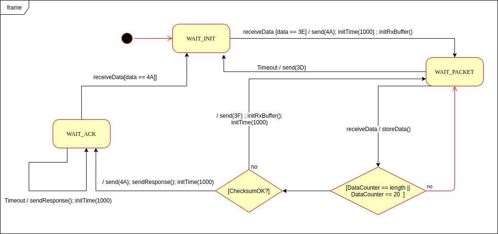
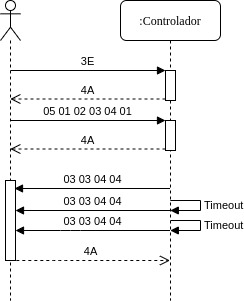

Semana 15
================

Unidad 8: máquinas de estado
----------------------------------
En esta última unidad del curso vamos a abordar
una técnica de construcción de software para el microcontrolador
que permitirá hacer un uso eficiente de la CPU y adicionalmente
poder realizar varias tareas de manera concurrente.

Actividades
^^^^^^^^^^^^^

Actividad 1
*************
* Fecha:octubre 14 de 2020 - 8 a.m.
* Descripción: encuentro sincrónico para trabajar de manera
  grupal en los ejercicios.
* Recursos: ingresa al grupo de Teams.
* Duración de la actividad: 1 hora 40 minutos 
* Forma de trabajo: colaborativo con solución de dudas en tiempo real.

Ejercicio 1: enunciado del problema
#####################################

En un proyecto interactivo se requiere conectar un controlador a una
aplicación interactiva (AI). 

Considere:

* Para simular la AI utilice scriptcommunicator. Esto se requiere porque debemos 
  transmitir bytes NO caracteres ASCII. Ojo!
* La AI siempre iniciará la comunicación.
* La secuencia de bytes más grande será de 20 bytes.

PASOS para realizar la comunicación:

1. La AI inicia una transacción enviando el byte 3E.
2. El controlador deberá responder con el byte 4A.
3. La AI no podrá continuar hasta no recibir la respuesta del controlador.
   Una vez el controlador responda, la AI enviará al controlador
   un paquete de bytes así:

.. code-block:: cpp
   :lineno-start: 1

    Byte 1 : longitud
    Byte 2 : Dirección
    Byte 3 : Comando
    Byte 4 a n : Datos
    Byte n+1: verificacion

* El byte de longitud, es el primer byte de la trama e indica cuántos bytes la AI
  enviará a continuación, es decirm de byte 2 hasta el byte n + 1.
* La AI calculará el byte de verificación así: Byte1 XOR Byte2 XOR … XOR ByteN.
* En C la operación XOR se realiza utilizando el operador 

.. code-block:: cpp
   :lineno-start: 1

   ^

4. El controlador esperará hasta un 1 segundo a que la trama llegue. Si esta condición
  NO se cumple el controlador enviará a la AI el byte 3D. La AI deberá inciar de
  nuevo la secuencia de comunicación desde el paso 1. 
  
  Una vez el controlador tenga la trama completa calculará el byte de cerificación
  de la misma manera que la AI lo hizo. El resultado debe ser igual al bytes de verificación
  recibido. Sí el byte de verificación calculado no corresponde al byte de verificación
  recibido, el controlador enviará el byte 3F y la AI deberá reenviar la trama. 
  Sí hay coincidencia el controlador deberá responder a la AI con el byte 4A y luego enviar
  la siguiente secuencia de bytes:

.. code-block:: cpp
   :lineno-start: 1

    Byte 1 : longitud
    Byte 2 : Byte4 recibido
    Byte m : Byten recibido
    Byte m+1 : verificación

5. Sí la AI recibe correctamente el paquete deberá responder con el byte 4A. 
   El controlador quedará preparado para volver al paso 1, es decir, esperar por una nueva
   trama. Sí ha pasado 1 segundo y el controlador no recibe el 4A, entonces deberá
   retransmitir el paquete a la AI. Este comportamiento solo se detendrá hasta que la
   AI envie el 4A.

Ejercicio 2: modelo de la solución
#####################################

Un posible modelo de la solución es este:

Ejercicio 3: implementación
#####################################

Y una posible implementación del modelo es este otro modelo en C++:

.. code-block:: cpp 
   :lineno-start: 1

    void setup() {
      Serial.begin(115200);
    }
    
    void taskCom() {
      enum class state_t {WAIT_INIT, WAIT_PACKET, WAIT_ACK};
      static state_t state = state_t::WAIT_INIT;
      static uint8_t bufferRx[20] = {0};
      static uint8_t dataCounter = 0;
      static uint32_t timerOld;
      static uint8_t bufferTx[20];
    
      switch (state) {
        case  state_t::WAIT_INIT:
          if (Serial.available()) {
            if (Serial.read() == 0x3E) {
              Serial.write(0x4A);
              dataCounter = 0;
              timerOld = millis();
              state = state_t::WAIT_PACKET;
            }
          }
    
          break;
    
        case state_t::WAIT_PACKET:
    
          if ( (millis() - timerOld) > 1000 ) {
            Serial.write(0x3D);
            state = state_t::WAIT_INIT;
          }
          else if (Serial.available()) {
            uint8_t dataRx = Serial.read();
            if (dataCounter >= 20) {
              Serial.write(0x3F);
              dataCounter = 0;
              timerOld = millis();
              state = state_t::WAIT_PACKET;
            }
            else {
              bufferRx[dataCounter] = dataRx;
              dataCounter++;
    
              // is the packet completed?
              if (bufferRx[0] == dataCounter - 1) {
    
                // Check received data
                uint8_t calcChecksum = 0;
                for (uint8_t i = 1; i <= dataCounter - 1; i++) {
                  calcChecksum = calcChecksum ^ bufferRx[i - 1];
                }
                if (calcChecksum == bufferRx[dataCounter - 1]) {
                  bufferTx[0] = dataCounter - 3; //Length
                  calcChecksum = bufferTx[0];
    
                  // Calculate Tx checksum
                  for (uint8_t i = 4; i <= dataCounter - 1; i++) {
                    bufferTx[i - 3] = bufferRx[i - 1];
                    calcChecksum = calcChecksum ^ bufferRx[i - 1];
                  }
    
                  bufferTx[dataCounter - 3] = calcChecksum;
                  Serial.write(0x4A);
                  Serial.write(bufferTx, dataCounter - 2);
                  timerOld = millis();
                  state = state_t::WAIT_ACK;
                }
                else {
                  Serial.write(0x3F);
                  dataCounter = 0;
                  timerOld = millis();
                  state = state_t::WAIT_PACKET;
                }
              }
            }
          }
    
          break;
    
        case state_t::WAIT_ACK:
          if ( (millis() - timerOld) > 1000 ) {
            timerOld = millis();
            Serial.write(bufferTx, dataCounter - 2);
          } else if (Serial.available()) {
            if (Serial.read() == 0x4A) {
              state = state_t::WAIT_INIT;
            }
          }
    
          break;
      }
    }
    
    
    void loop() {
      taskCom();
    }

Ejercicio 4: un escenario de prueba
#####################################
Un ejemplo de una escenario de prueba:

Actividad 2
*************
* Fecha: octubre 14 a octubre 16 de 2020.
* Descripción: continuar con los ejercicios
* Recursos: ejercicios propuestos. 
* Duración de la actividad: 5 horas de trabajo autónomo
* Forma de trabajo: individual.

Analiza de nuevo los ejercicios anteriores y prepárate para
un reto la próxima sesión.

Actividad 3
*************
* Fecha: octubre 16 de 2020 - 8 a.m.
* Descripción: solución de dudas de los ejercicios.
* Recursos: ingresa al grupo de Teams.
* Duración de la actividad: 1 hora 40 minutos 
* Forma de trabajo: colaborativo con solución de dudas en tiempo real.

RETO 
#######

Se requiere construir una aplicación para controlar una bomba temporizada.
La siguiente figura ilustra la interfaz de la bomba. El circuito de control
de la bomba está compuesto por tres sensores digitales,
en este caso pulsadores, denominados UP, DOWN, ARM ,
un display serial (enviaremos datos al puerto serial) y una salida digital 
para activar la bomba (LED).

El controlador funciona así:

.. image:: ../_static/bomb.png

* Inicia en modo de configuración, es decir, no cuenta aún, la bomba está
  ``desarmada``. El valor inicial del conteo regresivo es de 20 segundos.
* En el modo de configuración, los pulsadores UP y DOWN permiten
  aumentar o disminuir el tiempo inicial de la bomba.
* El tiempo se puede programar entre 10 y 60 segundos con cambios de 1 segundo.
* El tiempo de configuración se debe visualizar en el LCD (enviamos el
  valor al PC).
* El pulsador ARM arma la bomba.
* Una vez armada la bomba, comienza la cuenta regresiva que será visualizada
  en el LCD en por medio de una cuenta regresiva en segundos.
* La bomba explotará (se activa la salida de activación de la bomba) cuando
  el tiempo llegue a cero. En este punto el control regresará al modo de
  configuración.
* Una vez la bomba esté armada es posible desactivarla ingresando un código
  de seguridad. El código será la siguiente secuencia de pulsadores
  presionados uno después de otro:  UP, DOWN, DOWN, UP, UP, ARM.
* Si la secuencia se ingresa correctamente el controlador pasará de nuevo
  al modo de configuración de lo contrario continuará la fatal cuenta
  regresiva.

Para este ejercicio debes:

* Realizar un diagrama con el modelo en máquinas de estado para la aplicación
* Definir escenarios de prueba usando diagramas de secuencias.
* Implementar el modelo.
* Verificar los escenarios definidos
